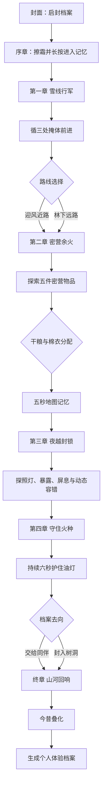
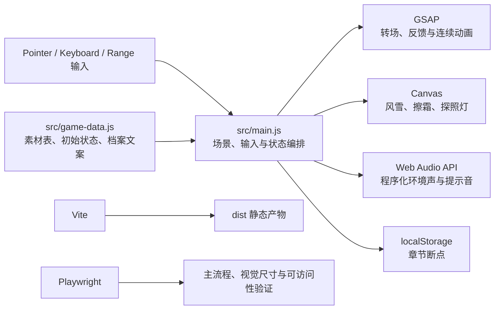

# 雪线余火

> 一部以东北抗联斗争环境为背景的移动端沉浸式互动叙事作品。
>
> 护送一份联络档案穿过封锁。活下去不是为了赢下一局，而是为了让火种抵达。

<p align="center">
  <a href="https://qwe111qwyt.github.io/snowline-embers/"><strong>在线体验</strong></a>
  &nbsp;·&nbsp;
  <a href="#快速开始"><strong>本地运行</strong></a>
  &nbsp;·&nbsp;
  <a href="#测试与质量保障"><strong>测试说明</strong></a>
</p>

<p align="center">
  
</p>

## 作品概览

| 项目 | 内容 |
| --- | --- |
| 作品名称 | 雪线余火（Snowline Embers） |
| 作品类型 | 移动端 H5 / 沉浸式互动叙事 / 红色文化数字传播 |
| 主题背景 | 东北抗联斗争环境下的交通联络、密营生活与封锁穿越 |
| 核心命题 | 当生存资源、同伴责任与任务目标发生冲突时，玩家如何理解“让信息继续前行”的代价 |
| 目标受众 | 青少年、历史文化展陈观众、移动端互动内容用户 |
| 体验规格 | 竖屏 9:16，建议佩戴耳机，目标单局时长 8-12 分钟 |
| 当前版本 | `2.0.0` |
| 运行方式 | 现代浏览器在线访问，或构建为完全静态的离线演示包 |
| 推荐设备 | 360×800 至 430×932 的触屏设备；桌面端自动居中为 9:16 舞台 |

《雪线余火》没有把历史题材处理成以积分、击杀或“完美结局”为目标的闯关游戏。玩家扮演一名艺术化合成的年轻交通员，通过擦拭、长按、拖动、观察、记忆与选择完成一次档案护送。体温、体力、暴露和同伴关系会持续记录玩家的行动，前一章的选择会改变后一章的提示、资源和风险，最终生成一份不作评分的个人体验档案。

## 创作背景与设计目标

传统观看式内容擅长传递结论，却不容易让观众体会极寒、隐蔽、物资匮乏和组织协作所构成的具体处境。本项目尝试用“可感知的代价”代替抽象说教：迎风近路会损失体温，绕行会消耗体力，把物资交给同伴会削弱自身，却可能在封锁线上获得真实帮助。

作品遵循四项设计原则：

1. **互动服务叙事**：每种手势都对应情境含义，而非为了增加操作数量。
2. **选择保留代价**：不设置简单的善恶分值，不用“标准答案”削弱历史处境的复杂性。
3. **失败不羞辱玩家**：潜行失误采用回退、节奏放缓和动态辅助，不以反复死亡打断情绪。
4. **史实与虚构分界**：人物和任务承担叙事功能，终章明确提示艺术化合成边界。

## 核心亮点

### 1. 手势即叙事

- 擦去档案照片上的霜，完成“启封记忆”。
- 长按进入历史、按住屏息、持续护住火苗，让等待和压力成为体验的一部分。
- 拖动角色穿行雪地，松手后自动伏低并吸附掩体；足迹会逐渐被风雪覆盖。
- 拖动今昔对照滑杆，让黑白旧影逐步退回当代山河。

### 2. 选择跨章节生效

路线、物资与同伴选择不是一次性文案分支，而会改变后续数值与潜行规则。

| 选择 | 即时代价 | 后续影响 |
| --- | --- | --- |
| 迎风近路 | 体温 `-15`、体力 `-5`、暴露 `+5` | 路程更短，但低温视觉反馈更明显 |
| 林下远路 | 体温 `-7`、体力 `-12` | 脚印更隐蔽，但夜行前体力更低 |
| 留下干粮 | 体力 `+20` | 自身屏息余量更充足 |
| 分给老周 | 体力 `-8`、同行关系 `+1` | 夜越封锁时获得一次声响掩护，降低暴露 |
| 自己穿棉衣 | 体温 `+22` | 屏息体力消耗降低 |
| 棉衣交给小满 | 体温 `-8`、同行关系 `+1` | 自动开启辅助潜行，并提示灯光折返方向 |
| 地图记忆错误 | 暴露 `+8`，巡逻搜索次数记为 `1` | 后续巡逻节奏与容错规则随之调整 |

### 3. 可解释的动态潜行

夜间探照灯由 Canvas 实时绘制，并使用与画面一致的扇形几何进行判定。系统区分灯光边缘、中心区域和持续照射时间：边缘照射累积暴露，中心持续停留触发搜索，屏息可将暴露增长系数降至 `0.28`。被发现后角色退回最近掩体；连续失误会自动降低难度、描出光域边缘，让玩家继续理解故事而非卡在操作上。

### 4. 选择生成个人档案

终章根据路线、物资分配、旧药箱记忆和档案去向组合生成个人体验档案。它不显示总分或优劣结局，而是复述玩家承担过的代价，并把历史记忆从“游戏结果”重新交还给体验者。

### 5. 面向展演的可靠性设计

- 26 项图像资源在进入体验前统一预载，避免章节切换白屏。
- 关键进度写入 `localStorage`，刷新或意外退出后可按章节继续。
- 页面切入后台时暂停动画循环与音频，返回后恢复。
- 支持静音、字幕式反馈、低动态模式、辅助潜行和 `aria-live` 状态播报。
- 使用 Pointer Events 统一鼠标与触屏输入；支持刘海屏和底部手势安全区。
- 无 CDN、在线字体和远程接口依赖，构建产物可离线部署。

## 叙事与交互流程



### 六段体验

| 段落 | 核心交互 | 叙事作用 |
| --- | --- | --- |
| 序章：冰封档案 | 擦霜、长按 | 从现实进入记忆，建立档案叙事框架 |
| 第一章：雪线行军 | 拖动、掩体吸附、物件发现、路线选择 | 认识自然环境与路线代价 |
| 第二章：密营余火 | 五物探索、资源分配、限时记忆 | 认识匮乏处境和组织协作 |
| 第三章：夜越封锁 | 动态光域、屏息、回退 | 让前序选择转化为可感知的风险与帮助 |
| 第四章：守住火种 | 六秒持续按压、档案去向选择 | 用身体化操作承接“守护”主题 |
| 终章：山河回响 | 今昔滑杆、档案生成 | 从个体经历回到公共记忆与现实反思 |

## 系统设计

### 状态模型

核心状态集中定义在 `src/game-data.js`，主要分为四类：

| 类型 | 字段 | 用途 |
| --- | --- | --- |
| 章节状态 | `scene`、`dayStep`、`nightStep` | 控制场景和掩体推进 |
| 生存状态 | `warmth`、`stamina`、`exposure` | 驱动状态条、结霜强度、屏息与搜索判定 |
| 叙事状态 | `route`、`food`、`coat`、`archiveChoice`、`memories` | 记录选择并生成终章档案 |
| 可用性状态 | `muted`、`reduced`、`assisted`、`running` | 控制声音、动效、辅助模式和后台暂停 |

所有可见状态值经过 `0-100` 约束。存档时会排除屏息、临时掩蔽等瞬时状态，恢复时按章节重建场景，避免把中断瞬间错误还原为不可操作状态。

### 技术架构



### 技术选型

| 技术 | 项目中的职责 | 选择理由 |
| --- | --- | --- |
| 原生 HTML / CSS / JavaScript | 语义结构、状态逻辑、交互控制 | 运行链路短，适合轻量 H5 和离线展演 |
| GSAP `3.x` | 场景转场、长按进度、角色移动、提示动画 | 时间线控制稳定，便于统一低动态策略 |
| Canvas 2D | 擦霜、程序化风雪、探照灯光域 | 高频绘制成本可控，视觉与几何判定可同步 |
| Web Audio API | 合成低频风声和操作提示音 | 无需额外音频文件，减小包体并支持动态混音 |
| Lucide `0.544` | 操作与状态图标 | 语义统一，避免不可控的图片文字 |
| Vite `7.x` | 开发服务与生产构建 | 构建快速，可通过相对路径部署到任意静态目录 |
| Sharp `0.35` | 原始素材自动转 WebP | 统一宽度、质量和透明通道，降低人工导出误差 |
| Playwright `1.63` | 端到端自动化测试 | 可真实验证触控流程、Canvas 输出与响应式布局 |

## 工程结构

```text
snowline-embers/
├─ .github/workflows/deploy-pages.yml  # GitHub Pages 自动构建与发布
├─ public/assets/                      # 26 项运行时 WebP 素材
├─ scripts/prepare-assets.mjs          # 原始 PNG → WebP 增量处理脚本
├─ src/
│  ├─ main.js                          # 页面结构、章节编排、输入与交互逻辑
│  ├─ game-data.js                     # 素材映射、初始状态与档案生成规则
│  ├─ audio-manager.js                 # Web Audio 环境声、提示音和生命周期
│  └─ style.css                        # 9:16 舞台、场景视觉与响应式样式
├─ tests/prototype.spec.js             # Playwright 全流程及适配测试
├─ index.html                          # 应用入口与移动端视口设置
├─ vite.config.js                      # 相对路径静态构建配置
├─ playwright.config.js                # 端到端测试配置
└─ package.json                        # 依赖与项目命令
```

开发仓库还包含原始素材、分批交付包和设计方案。这些大体积文件不进入生产构建；浏览器只加载 `public/assets/` 中的优化版本。当前 26 项 WebP 素材合计约 **1.84 MiB**。

## 快速开始

### 环境要求

- Node.js `20.19+` 或 `22.12+`
- npm `10+`（随 Node.js 安装即可）
- Chromium、Chrome、Edge 或 Safari 等现代浏览器

在 Windows PowerShell 中运行：

```powershell
git clone https://github.com/qwe111qwyt/snowline-embers.git
Set-Location snowline-embers
npm.cmd ci
npx vite --host 0.0.0.0
```

开发服务器默认监听所有网卡。终端会显示本机和局域网地址；手机与电脑处于同一网络时，可通过局域网地址真机体验。

macOS 或 Linux 将 `npm.cmd` 替换为 `npm`：

```bash
npm ci
npx vite --host 0.0.0.0
```

### 常用命令

| 命令 | 作用 |
| --- | --- |
| `npm run assets` | 将规范命名的原始 PNG 增量转换为运行时 WebP |
| `npm run dev` | 处理原始素材并启动 Vite；需要本地完整素材目录 |
| `npm run build` | 处理原始素材并生成 `dist/`；需要本地完整素材目录 |
| `npm run preview` | 本地预览生产构建 |
| `npm run test:e2e` | 执行 Playwright 端到端测试 |

> 从公开仓库克隆后，`public/assets/` 已包含构建所需 WebP。若本地没有被 `.gitignore` 排除的原始素材目录，请直接使用 `npx vite` 或 `npx vite build`；CI 也采用此方式，避免重复处理素材。

## 构建与部署

### 生成离线包

原始素材齐全时运行：

```powershell
npm.cmd run build
```

只有公开仓库内容时运行：

```powershell
npx vite build
```

产物位于 `dist/`。不要直接双击 `index.html`，应通过本地静态服务器打开，以保持 ES Module 和浏览器音频策略一致：

```powershell
npm.cmd run preview
```

### GitHub Pages

推送到 `main` 分支后，[部署工作流](./.github/workflows/deploy-pages.yml) 会使用 Node.js 20 安装依赖、构建静态文件并发布到 GitHub Pages。`vite.config.js` 使用相对基础路径 `./`，因此同一份 `dist/` 也能部署到学校服务器、对象存储或展厅内网。

在线地址：<https://qwe111qwyt.github.io/snowline-embers/>

## 测试与质量保障

首次运行测试前安装 Playwright 浏览器：

```powershell
npx playwright install chromium
npm.cmd run test:e2e
```

上述命令适用于包含原始素材目录的完整制作环境。仅使用公开仓库时，先在一个终端执行 `npx vite --host 127.0.0.1 --port 4173`，再在另一个终端执行 `npx playwright test`；测试配置会复用已启动的服务。

自动化测试覆盖：

- `390×844` 下从封面到个人档案的完整六段主流程。
- 擦霜 Canvas 初始化、所有图片自然尺寸和页面脚本错误。
- 三处日间掩体、旧药箱记忆、路线选择、密营五物探索与资源分配。
- 五秒地图记忆、夜间探照灯非空像素、三段潜行与六秒护火。
- 终章档案是否正确反映路线、同伴、记忆物件和档案去向。
- `360×800`、`390×844`、`430×932` 三类移动视口的边界适配。
- `1440×900` 桌面视口中的 9:16 居中舞台。
- 系统 `prefers-reduced-motion` 偏好和辅助潜行开关。

### 当前验证记录

2026-09-15 在本地开发环境完成验证：Vite 生产构建通过，生成 HTML `0.61 kB`、CSS `21.94 kB`（gzip `6.04 kB`）、JavaScript `119.56 kB`（gzip `44.96 kB`）；Playwright 共 `5` 个用例全部通过，用时 `34.1s`。该时间只用于证明测试已执行，不代表目标手机的性能基准。

建议在正式提交前补充以下人工验收：

| 维度 | 验收方法 | 通过标准 |
| --- | --- | --- |
| 首次理解 | 邀请未看说明的用户试玩 | 10 秒内理解移动与掩体操作 |
| 选择反馈 | 试玩后口头复述 | 能说出至少一项选择对后续的影响 |
| 真机稳定 | 三台不同性能手机连续运行 | 无白屏、无输入失效、无音画阻塞 |
| 弱网/离线 | 断网运行构建包 | 主流程与全部素材正常 |
| 无声体验 | 全程静音完成 | 所有威胁和剧情信息仍可理解 |
| 历史表达 | 史料顾问逐条审校 | 具体事实可追溯，虚构内容标识清楚 |

## 适配与可访问性

- 舞台以 `100dvh` 和 `9:16` 最大宽度约束，移动端满屏、桌面端居中，不拉伸画面。
- 顶部和底部交互区使用 `env(safe-area-inset-*)` 适配刘海屏与系统手势区。
- 低于 700px 高度时压缩叙事区和道具区，保证核心操作不越界。
- 系统低动态偏好会关闭路径点、角色、危险边缘和火苗动画，并将 GSAP 时长降为零。
- 辅助潜行会扩大探照灯容错、显示光域轮廓；连续两次搜索后也会动态启用帮助。
- 图标按钮具备可读标签和 `title`，重要短提示同步写入无障碍实时区域。
- 所有关键剧情均以屏幕文字表达，静音不会损失信息。

## 素材生产与性能策略

`scripts/prepare-assets.mjs` 维护一份明确的素材清单，对背景、角色和道具分别设置输出宽度与 WebP 品质。脚本比较源文件与目标文件的修改时间，只重建发生变化的素材，并将透明通道质量设为 `92`。

运行时策略包括：

- Canvas 像素比最高限制为 `2`，避免高分屏产生过大的绘制缓冲区。
- 普通场景使用 32-76 个程序化雪粒；低动态模式最多 28 个。
- 高频角色拖动使用 `gsap.quickTo`，避免在每次指针移动时创建新时间线。
- 离开章节时统一停止动画时间线、`requestAnimationFrame`、雪粒循环和地图计时器。
- 足迹以 110ms 节流生成，并在 4.5 秒后自动移除。
- 环境声由 Web Audio 实时合成，不增加网络音频资源。

## 竞赛陈述建议

### 一句话介绍

《雪线余火》用一次必须承担代价的档案护送，让观众从“观看东北抗联历史”转向“在极寒、匮乏与封锁中作出选择”。

### 三分钟答辩结构

| 时间 | 展示内容 | 评审信息点 |
| --- | --- | --- |
| 0:00-0:25 | 封面、擦霜与长按进入 | 历史记忆不是背景装饰，手势本身承担叙事 |
| 0:25-1:10 | 路线、干粮或棉衣选择 | 选择会跨章节改变数值、提示与同伴帮助 |
| 1:10-1:55 | 探照灯、掩体、屏息和回退 | 视觉判定一致；动态容错避免用失败消费苦难 |
| 1:55-2:25 | 六秒护火与今昔叠化 | 从身体化操作过渡到当代记忆 |
| 2:25-3:00 | 个人档案、测试和史实声明 | 无评分结局、真机适配、离线能力与创作边界 |

### 建议提交材料

- H5 在线版、`dist/` 离线包与完整源码。
- 3 分钟演示视频，前 20 秒呈现擦霜或潜行等核心互动。
- 海报、答辩 PPT、交互流程图、技术架构图和真机测试记录。
- 史料来源表、专家审校记录、关键文案逐条引用依据。
- AI 使用披露、生成平台条款、提示词日志、原图与后期修改过程。
- 素材授权表、字体与音频版权说明、各版本变更记录。

## 史实、伦理与 AI 合规

人物、路线、封锁和树洞等情节为基于东北抗联斗争环境的艺术化合成，不对应单一真实人物或具体战斗。作品不设置击杀玩法，不以胜负改写历史，也不承诺虚构角色的个人结局。

正式参赛前必须完成以下工作：

1. 依据纪念馆、档案馆、地方志、权威党史军史出版物和研究论文，复核年份、地域、服装、装备、物件与叙事表述。
2. 为每项具体史实建立可追溯来源；虚构台词和复合人物不得包装为原始史料。
3. 核对当届赛事对生成式 AI、素材授权、作品原创性、联网能力和包体大小的规定。
4. 保存素材生成模型、日期、提示词、原始输出、人工修图记录、版本和授权信息。
5. 对角色手部、服饰细节、武器年代、图中文字和视觉一致性进行人工复核。

仓库中的设计方案是创作与实现依据，不等同于完成史实终审。正式对外传播前，应由具备相关背景的指导教师或史料顾问签字确认。

## 已知边界与后续计划

- 当前环境声与提示音由 Web Audio 程序化生成，尚未加入经授权的旁白与拟音素材。
- 当前场景以两张主背景进行构图复用；竞赛终版可在史实与视觉审核通过后补齐章节专属背景。
- 当前自动化测试聚焦 Chromium；正式参赛前还需完成 iOS Safari、Android 微信内置浏览器和低端设备测试。
- 当前进度恢复以章节为粒度，恢复后会重置该章局部探索或掩体步骤，优先保证状态一致与可继续体验。
- 当前档案编号为叙事视觉元素，不代表真实馆藏编号。

## 版权与使用说明

项目仓库暂未声明开源许可证。未经权利人明确授权，不得将源码、视觉素材或文案用于再发布、商业使用或训练数据。参赛团队应在提交前补齐成员署名、素材来源、授权范围、指导教师与史料顾问信息。

---

**作品主题句：** 白山黑水犹在。记忆被交到我们手中。
